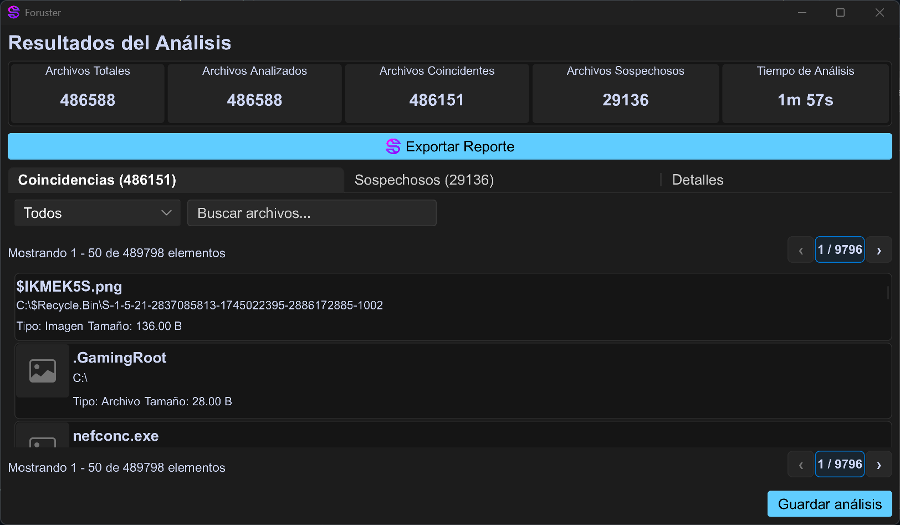

# Foruster 🕵️

Foruster is a modern, cross-platform tool for **live-system digital forensic analysis**. Built with Rust for performance and safety, it provides a powerful yet intuitive desktop application for identifying, cataloging, and preserving digital evidence on active storage volumes without requiring a system shutdown.

Its user interface, crafted with the [Slint](https://slint.dev/) framework, guides analysts through device selection, profile-based scanning, and real-time visualization of findings, streamlining the critical initial triage phase of an investigation.



---

## ✨ Core Features

*   **Live System Analysis:** Analyze storage devices on a running system, preserving volatile data and accessing unlocked encrypted volumes (BitLocker, LUKS) that are already mounted.
*   **Cross-Platform:** A single codebase provides a native experience on both **Windows** and **Linux**.
*   **🧬 Heuristic Anomaly Detection:** Automatically flags suspicious files based on:
    *   **Content Mismatch:** Detects files where the content (verified by "magic numbers") does not match the file extension (e.g., an `.exe` file disguised as a `.jpg`).
    *   **Deceptive Extensions:** Identifies patterns like `report.pdf.exe` used to trick users.
*   **🎯 Profile-Based Scanning:** Use pre-defined or custom profiles to quickly search for specific file categories (e.g., Documents, Images, Applications), MIME types, or extensions.
*   **🛡️ Forensic Integrity:** Ensures the integrity of findings by calculating multiple cryptographic hashes (**MD5, SHA-256, and BLAKE3**) for each identified file.
*   **📋 Comprehensive Reporting:** Generate detailed forensic reports in PDF format, creating a signed manifest of the analysis, findings, and hashes to support an auditable chain of custody.
*   **🚀 High-Performance Engine:** The analysis core is built on the [Tokio](https://tokio.rs/) asynchronous runtime, enabling efficient, parallel scanning of the filesystem.
*   **🖥️ Modern UI:** A clean, responsive, and intuitive graphical user interface built with Slint.

## Why Foruster? The Challenge of Live Forensics

Traditional digital forensics often relies on "dead-box" analysis, where a complete bit-for-bit image is taken of a powered-off storage device. While thorough, this method has significant drawbacks:

*   **Loss of Volatile Data:** RAM contents, active network connections, and temporary files are lost upon shutdown.
*   **Encryption Hurdles:** Accessing data on encrypted volumes (like BitLocker or LUKS) is complex and may be impossible without recovery keys.
*   **Time-Consuming:** Imaging large disks can take hours, delaying the initial assessment of a situation.

Foruster addresses these challenges by enabling **live triage**. By running on an active system, it can:
*   **Access Decrypted Data:** Analyze files on encrypted volumes that are already unlocked and mounted by the operating system.
*   **Provide Rapid Insight:** Quickly identify relevant files and potential threats, allowing an analyst to determine if a full, time-intensive acquisition is necessary.
*   **Preserve System State:** Minimize the footprint on the target system, reducing the risk of altering crucial evidence.

## 🏗️ Architecture

Foruster is built with a modular architecture, organized as a Rust workspace to ensure separation of concerns and maintainability.

*   **`desktop` (Presentation Layer):** The Slint-based GUI that provides the user interface.
*   **`api` (API Layer):** A bridge that provides a safe and ergonomic interface between the backend logic and the UI.
*   **`analysis` (Analysis Engine):** The core logic for file system walking (using `async-walkdir`), applying profiles, and detecting anomalies. Powered by Tokio.
*   **`profiling` (Profiling Engine):** Defines the structure and criteria for the analysis profiles used to find specific types of files.
*   **`foruster-storage` (Storage Layer):** A platform-agnostic crate that abstracts away the OS-specific details of detecting and querying storage devices. It uses the Win32 API on Windows and interacts with `/sys/block` and `/proc` on Linux.

## 🚀 Getting Started

### Prerequisites

1.  **Rust Toolchain:** Install Rust via [rustup](https://rustup.rs/). Foruster is built with the latest stable version of Rust.
    ```bash
    curl --proto '=https' --tlsv1.2 -sSf https://sh.rustup.rs | sh
    ```
2.  **System Dependencies:**
    *   **Linux:** You'll need `pkg-config` and development libraries for `fontconfig`.
      ```bash
      # On Debian/Ubuntu
      sudo apt-get install build-essential pkg-config libfontconfig1-dev
      # On Fedora
      sudo dnf install clang gcc-c++ make pkg-config fontconfig-devel
      ```
    *   **Windows:** You'll need the MSVC build tools, which can be installed with the "Desktop development with C++" workload in the Visual Studio Installer.

### Building from Source

1.  Clone the repository:
    ```bash
    git clone https://github.com/m4rz3r0/foruster.git
    cd foruster
    ```

2.  Build the application in release mode:
    ```bash
    cargo build --release
    ```

3.  Run the compiled binary:
    ```bash
    ./target/release/desktop
    ```

## 📋 Usage Workflow

1.  **Launch Foruster:** Start the application. On Windows, you may need to "Run as Administrator" to get full access to physical drives.
2.  **Select Devices:** The initial screen displays all detected storage devices. Select one or more devices to include in the analysis.
3.  **Manage Paths:** Foruster automatically populates the analysis scope with the mount points of the selected devices. You can add or remove specific directories to fine-tune the scope.
4.  **Choose Profiles:** Select one or more analysis profiles (e.g., "Documents," "Images," "Compressed Files") to guide the search.
5.  **Analyze:** Start the analysis. A real-time progress screen will show statistics, including files scanned, matches found, and suspicious items detected.
6.  **Review Findings:** Once complete, explore the results:
    *   The **Matches** tab lists all files that fit the selected profiles, with filtering and search capabilities.
    *   The **Suspicious** tab highlights files with content/extension mismatches or deceptive naming.
7.  **Export Report:** Generate a comprehensive PDF report that documents the analysis scope, device details, findings, and cryptographic hashes for all relevant files.

## 🤝 Contributing

Foruster is an open-source project, and contributions are welcome! Whether it's reporting a bug, suggesting a feature, or submitting a pull request, your help is appreciated.

Please check the [issues page](https://github.com/m4rz3r0/foruster/issues) to see where you can contribute.

## 📜 License

This project is licensed under the **GNU General Public License v3.0**. See the [LICENSE](LICENSE) file for details.

## 🙏 Acknowledgements

This initiative is carried out within the framework of the funds from the Recovery, Transformation and Resilience Plan, financed by the European Union (Next Generation) - National Institute of Cybersecurity (INCIBE) in the project C108/23 "Detection of Identity Document Forgery using Computer Vision and Artificial Intelligence Techniques".
