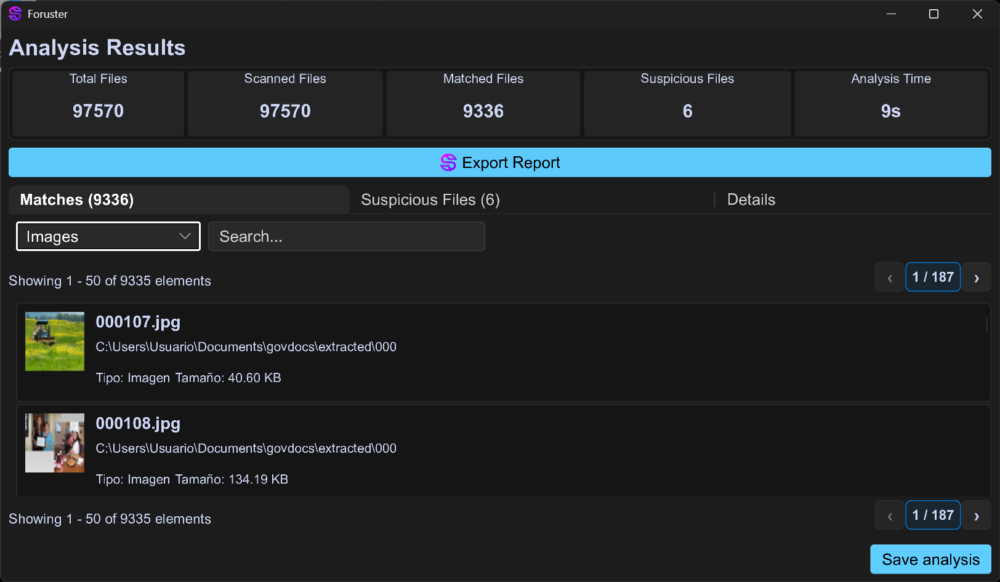
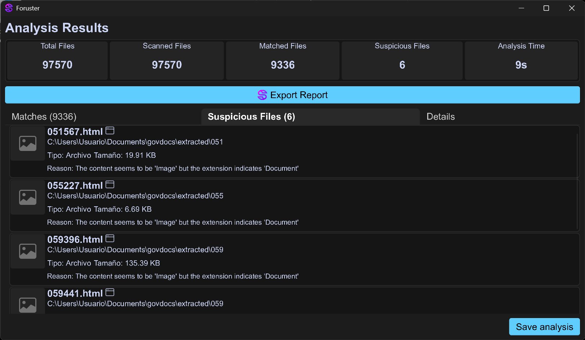

<div align="center">
  <h1>Foruster</h1>

  <p align="center">
    <strong>Live Forensic Triage & Anomaly Detection Tool</strong>
  </p>

  <p align="center">
    <a href="https://slint.dev">
      
    </a>
  </p>

  <p align="center">
    
    
    
  </p>
</div>

---

## 📖 Introduction

**Foruster** is a cross-platform desktop application designed for **live-system forensic analysis**. Unlike traditional tools that require system shutdown and disk imaging ("dead-box" forensics), Foruster allows investigators to identify, catalog, and analyze files of interest on active storage volumes in real-time.

Written in **Rust** for memory safety and performance, and utilizing the **Slint** framework for a modern GUI, Foruster is built to assist in incident response scenarios where speed and preserving the system state are crucial.

## ✨ Key Features

*   **🔍 Live Analysis:** Scan active storage devices (HDD, SSD, NVMe, USB) and mounted volumes (including BitLocker/LUKS if mounted).
*   **🧬 Heuristic Anomaly Detection:**
    *   **Content Mismatch:** Detects files where the content (Magic Numbers) does not match the file extension (e.g., an EXE disguised as a JPG).
    *   **Deceptive Extensions:** Identifies double extension patterns (e.g., `invoice.pdf.exe`).
*   **🛡️ Forensic Integrity:** Automatically calculates cryptographic hashes (**MD5**, **SHA-256**, **BLAKE3**) for identified files to ensure chain of custody.
*   **🎯 Profile-Based Search:** Quickly filter artifacts using customizable profiles (Audio, Video, Documents, Executables, etc.).
*   **📄 PDF Reporting:** Generates comprehensive forensic reports summarizing findings, suspicious files, and device information.
*   **⚡ Async Architecture:** Built on the Tokio runtime for efficient, non-blocking filesystem traversal.

## 📸 Screenshots

| Match Results | Suspicious Files |
|:---:|:---:|
|  |  |

> *The interface facilitates rapid triage by separating confirmed profile matches from suspicious anomalies.*

## 🏗️ Architecture

Foruster is organized as a Rust Workspace to ensure modularity and separation of concerns:

| Crate | Description |
| :--- | :--- |
| **`desktop`** | The presentation layer. Contains the **Slint** UI code and frontend logic. |
| **`analysis`** | The core engine. Handles recursive filesystem walking (`async-walkdir`) and anomaly detection logic. |
| **`storage`** | Hardware abstraction layer. Interacts with Win32 APIs (Windows) or `/sys` & `/proc` (Linux) to enumerate physical disks and partitions. |
| **`profiling`** | Defines file profiles (MIME types, extensions) and categorization rules. |
| **`reporting`** | Handles the generation of the PDF forensic report. |
| **`api`** | Bridges the backend logic (Analysis/Storage) with the Frontend (Desktop). |
| **`core`** | Shared data structures and utility functions (hashing, formatting). |

## 📦 Installation & Build

### Prerequisites

*   **Rust Toolchain:** (1.87+ recommended)
*   **System Dependencies:**
    *   **Linux:** `libfontconfig1-dev`, `libxcb` (standard Slint requirements).
    *   **Windows:** MSVC Build Tools.

### Build from Source

```bash
# Clone the repository
git clone https://github.com/m4rz3r0/foruster.git
cd foruster

# Build and run in release mode
cargo run --release
```

## 🛠️ Usage

1.  **Select Disks:** Upon launch, Foruster enumerates connected physical disks. Select the drives you wish to analyze.
2.  **Select Profiles:** Choose what you are looking for (e.g., "Images", "Documents", "Compressed").
3.  **Analyze:** The tool scans the filesystem.
    *   **Matches Tab:** Shows files fitting the selected profiles.
    *   **Suspicious Tab:** Highlights potential threats (mismatched extensions).
4.  **Export:** Generate a PDF report containing the list of analyzed files, device serial numbers, and hash verifications.


## 🌍 Internationalization

Foruster is an open-source project and we welcome contributions to translate it into more languages. The project is currently translated using **Weblate**.

Current languages include:
*   🇬🇧 English (en_GB) - *In Progress*
*   🇪🇸 Spanish (es_ES) - *Base Language*
*   🇫🇷 French (fr_FR) - *In Progress*
*   🇵🇹 Portuguese (pt_PT) - *In Progress*

(Base template available in `foruster-desktop.po`)

<!-- ## 📄 Citation

If you use Foruster for academic research, please refer to the SoftwareX paper associated with this project:

> **Foruster: A Cross-Platform Tool for Live Forensic Triage and Anomaly Detection**
> *Sequera Fernández M.J., Homaei M., Mogollón Gutierrez Ó., Sancho Núñez J.C.*
-->

## ⚖️ License

This project is licensed under the **GNU General Public License v3.0**. See the [LICENSE](LICENSE) file for details.
